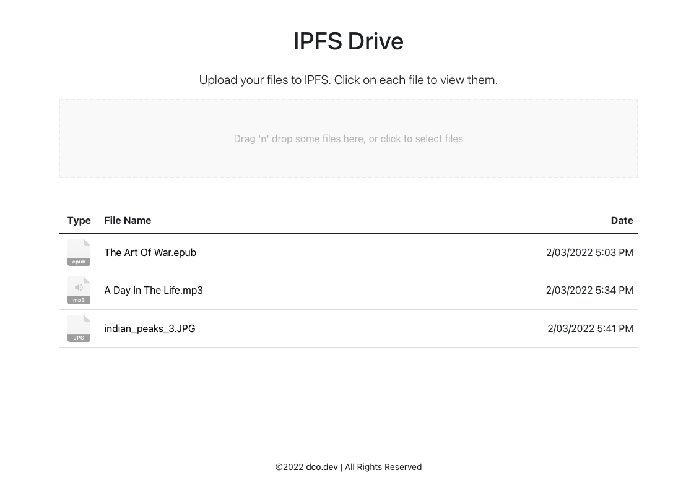

# IPFS Drive

View the live [demo](https://drive.dco.dev).



This application is a Web3 product that allows users to upload their files to [IPFS](https://ipfs.io/) and view them in a dashboard, very similar to Google Drive. However, this application is decentralized and allows users to interact with Web3.

This is a very simple product aimed to deliver a proof of concept for uploading and viewing files within IPFS in a web application built with JavaScript.

## Toolkit

This project includes the following tech:

- [IPFS JavaScript Client](https://js.ipfs.io/)
- [Infura](https://infura.io)
- [Truffle](https://trufflesuite.com/)
- [Solidity](https://soliditylang.org/)
- [React](https://reactjs.org/)
- [Bootstrap / Reactstrap](https://getbootstrap.com/)

## Running this app locally

This app is a Truffle app with a Create React App frontend in the `/client` directory which will need to be started.  This app also needs to connect to an IPFS daemon running a local node.  You'll also need a Web3 wallet to connect to the dApp and approve transactions.

### Prerequisites

- Local IPFS node
- Web3 Wallet

#### Install IPFS

You will need to install an IPFS node on your machine to start working locally. The easiest way to do this is to install [IPFS Desktop](https://docs.ipfs.io/install/ipfs-desktop/). If you already have an IPFS node on your computer, IPFS Desktop will act as a control panel and file browser for that node. If you don't have a node, it'll install one for you. And either way, IPFS Desktop will automatically check for updates.

You may also choose to work with the command line instead. You may follow [these docs](https://docs.ipfs.io/install/command-line/#system-requirements) to install via the CLI.

#### Run a local IPFS daemon

Once you have IPFS installed locally, you will need to spin up a daemon for the client app to connect to. The easiest way to do this is to just open up IPFS Desktop, which will connect to your local node to the network.

You may also use the CLI to spin one up by simply running `ipfs daemon` in the command line.  More docs can be found [here](https://docs.ipfs.io/how-to/command-line-quick-start/#take-your-node-online) for CLI use.

#### Install a Web3 wallet in your browser

You'll need an Ethereum-based wallet in your browser. The most popular one is the [MetaMask extension](https://metamask.io/download/), or you may use [Brave Browser](https://brave.com/) which contains a built in wallet.

### Run the app

Once you have IPFS installed and connected and a Web3 wallet in a browser, you can now run the client application. Install the dependencies via NPM or Yarn, and start the app.

```sh
# NPM
cd client
npm install
npm start

# Yarn
cd client
yarn install
yarn start
```

If you run into any problems, please submit an [issue](https://github.com/drewcook/dapp-ipfs-drive/issues/new) and I'll work quickly to help resolve it.  Thanks!

<p align="center">
 
</p>
